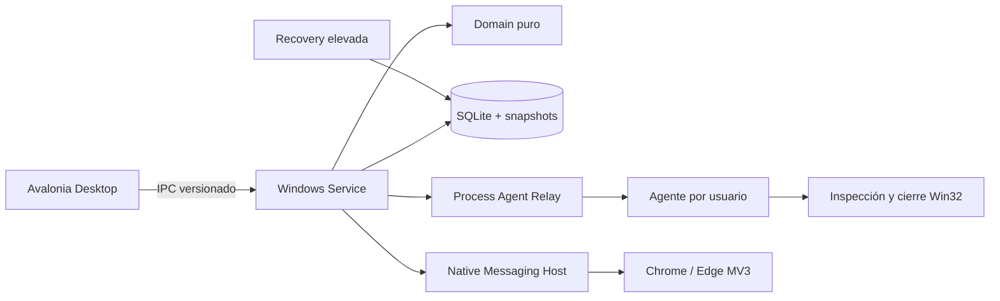
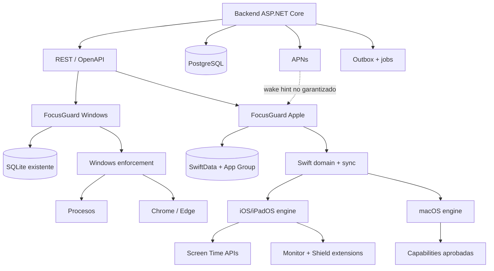

# FocusGuard Apple: plan técnico, producto y sincronización multiplataforma

## Estado del documento

- Estado: plan de arquitectura y producto con scaffold ejecutable y vertical slices iniciales; no es todavía el producto de producción.
- Workspace Apple: `C:\Users\Stuart\Documents\FocusGuard\Focus Guard iOS`.
- Workspace backend: `C:\Users\Stuart\Documents\FocusGuard\FocusGuard Backend`.
- Repositorio Windows existente: `C:\Users\Stuart\Documents\FocusGuard\FocusGuard-Autopilot`.
- repositorio focusguard ios: https://github.com/Estuardo666/focusguard-ios
- auditoría del repositorio remoto (2026-09-03): `Estuardo666/focusguard-ios` ya contiene la rama `main` y el commit inicial del laboratorio; antes de este push estaba vacío.
- Fecha de auditoría: 2026-09-03.
- Última verificación local del slice: 2026-09-03 15:35 -05:00 (Swift 38, backend 22, OpenAPI parseado, Windows 360, preflight Codemagic, YAML/plists/entitlements y scan de secretos verde; `BackendSyncChangeValidator` y `ScreenTimeSyncEngine` parseados). Tras el ajuste de Codemagic, GitHub Actions `33806360894` (commit `6d54c8a`, 2026-09-03 16:10 -05:00) volvió a pasar todos sus gates.
- Incidente Codemagic analizado: el build `6a99db72c6da4caa66735395` (workflow `sideload-lab`, commit `c96d56c`, 2026-09-03 15:41 -05:00) generó correctamente `/Users/builder/clone/FocusGuardApple.xcodeproj` y después terminó con código 1 porque el script ejecutaba `test -f FocusGuardApple.xcodeproj`; un `.xcodeproj` es un directorio y debe comprobarse con `test -d`. La corrección también añade `set -euo pipefail` y desactiva la auto-actualización/limpieza de Homebrew durante la instalación condicional de XcodeGen. Debe repetirse el workflow para cerrar el gate macOS.
- Segundo incidente Codemagic analizado: el build `6a99e3e1ff13901398c7d89a` (workflow `sideload-lab`, commit `808824c`, 2026-09-03 16:17 -05:00) superó XcodeGen y resolución de dependencias, pero `xcodebuild archive` terminó con código 65. El primer error fue `ScreenTimeLab/Extensions/DeviceActivityMonitor/FocusGuardDeviceActivityMonitor.swift:8:28: error: cannot find 'UserDefaults' in scope`; la extensión usaba `UserDefaults`/`PropertyListDecoder` sin importar `Foundation`. Se añadió el import explícito; hay que relanzar `sideload-lab` para comprobar el siguiente nivel de compilación.
- Tercer incidente Codemagic analizado: el build `6a99e7ab08de293eba25b860` (workflow `sideload-lab`, commit `638cf4e`, 2026-09-03 16:33 -05:00) superó la extensión de Device Activity y falló con código 65 en `ScreenTimeSyncStore.swift`: `cannot convert value of type 'Int64' to expected argument type 'Int'` y la conversión inversa para `expectedRevision`. La persistencia SwiftData usa `Int64` y el contrato de sync usa `Int`; se añadió conversión exacta en ambos sentidos, rechazando valores fuera de rango. El paquete pasó localmente 38/38 tests en `swift:6.2-jammy`; hay que relanzar Codemagic para confirmar el archive completo.
- Cuarto error del mismo build Codemagic: el build `6a99e7ab08de293eba25b860` (workflow `sideload-lab`, commit `638cf4e`, 2026-09-03 16:33 -05:00) tras superar la conversión de revisiones reveló dos errores de la app: `try? modelContext?.save()` usaba optional chaining después de hacer `if let modelContext`, y `ScreenTimeLabView.swift` no importaba el módulo `FocusGuardDomain` para `ScheduleWeekday`/`ScheduleDstPolicy`. Se corrigieron ambas referencias; preflight y 38/38 tests Swift pasan localmente. Debe relanzarse Codemagic con el commit `ec19684`.
- Objetivo de compatibilidad inicial Apple: iOS/iPadOS/macOS 26, usando el SDK estable disponible al iniciar el trabajo.
- Distribución Mac prioritaria: Mac App Store.
- MVP Apple: sin cuenta y totalmente offline.

## Estado de ejecución (2026-09-03)

Se ha ejecutado el primer vertical slice fuera de macOS:

- El workspace `FocusGuard Backend` ya contiene una solución .NET 10 con contratos, dominio de sincronización, API REST/OpenAPI, pruebas xUnit y esquema PostgreSQL objetivo.
- El API valida registro idempotente de dispositivos, cursores monotónicos, revisiones optimistas, claves de idempotencia y revocación de dispositivos. El ledger guarda además una huella SHA-256 ligada al dispositivo y a la mutación: reutilizar una clave con otro payload o desde otra instalación ahora se rechaza. `pull` también rechaza dispositivos revocados y las capacidades del dispositivo se normalizan con límites de contrato. Se verificó con build sin warnings, 22 pruebas .NET (incluida integración PostgreSQL opcional) y smoke tests HTTP; el adaptador PostgreSQL se probó contra PostgreSQL 16 temporal.
- `SyncAggregateValidator` valida los cuatro agregados del producto (`Profile`, `PlatformPolicy`, `Schedule`, `FocusSession`), compatibilidad de operación por agregado, límites de nombre/color, ventanas UTC, días ISO sin duplicados y DST; rechaza recursivamente campos de tokens Screen Time (incluido `policyJson` cuando llega como JSON serializado) antes de actualizar revisiones o el feed. La autorización del dispositivo ocurre antes de esta validación para que una instalación revocada reciba `403` sin revelar reglas del contrato.
- El workspace Apple ya contiene el paquete Swift compartido de dominio, pruebas Swift Testing y `codemagic.yaml` con workflows de laboratorio unsigned/signed. La compilación Swift, el entitlement Family Controls y el enforcement Screen Time siguen bloqueados hasta ejecutar en macOS/Xcode/Codemagic con un perfil autorizado.
- Tras añadir la materialización acotada de schedules, `TrustedClockState`, las reglas por plataforma, la reconciliación de sesiones y la validación defensiva del feed remoto, el paquete compartido queda en 38 pruebas Swift verdes (21 dominio y 17 sync); sigue siendo un núcleo de validación y no una sustitución del runner Apple.
- `codemagic.yaml` incluye ahora un workflow `package-only` que puede validar el dominio/outbox sin proyecto Xcode, además de `ios-screentime-lab` (firmado) y `sideload-lab` (IPA que Sideloadly re-firma). El workflow firmado declara `ios_signing` como `development` para `com.focusguard.apple`; Codemagic debe resolver también un perfil para cada extensión.
- `FocusGuardSync` añade un outbox local actor-isolated con deduplicación y cursor monotónico, independiente de SwiftData para poder probar invariantes antes de elegir el esquema de persistencia.
- `FocusScheduleMaterializer` convierte una recurrencia validada en ventanas UTC acotadas (por defecto hasta 30 ocurrencias), recortadas al rango solicitado; la materialización es pura y no requiere red, UI ni Screen Time.
- `TrustedClockState` conserva muestras server/local, marca desfases superiores a cinco minutos y usa el instante conocido más conservador cuando el reloj local retrocede; no extrapola tiempo de servidor offline.
- `SessionRuntimeEvaluator` acepta ese estado de reloj como entrada, por lo que una sesión persistida se evalúa con el instante conservador antes de decidir expiración offline.
- `SessionReconciler` codifica la convergencia de sesiones: adopta una sesión remota viva si no hay local, ignora intenciones ya terminadas, reporta solapamientos y nunca cancela una sesión Strict local antes de su deadline.
- El dominio expone `CommonProfilePolicy`, `WindowsDeviceRules`, `AppleMobileDeviceRules` y `MacOSDeviceRules`: la política común no contiene targets de plataforma y el binding Apple solo serializa revisión/flags, nunca tokens opacos.
- `ScreenTimeLocalModels.swift` añade los primeros modelos SwiftData (`LocalProfileRecord`, `LocalSessionRecord`, `LocalScheduleRecord`, `LocalPendingMutationRecord` y `LocalSyncMetadataRecord`) y un `ModelContainer` persistente en el App Group. El modelo mantiene el deadline absoluto de la sesión, la programación local y el outbox aunque la app o el backend estén fuera de línea; ya incluye `FocusGuardSchemaV1`/`FocusGuardMigrationPlan`, que aún debe probarse con una migración real en Codemagic antes de aceptar datos de producción.
- `ScreenTimeSyncStore.swift` añade el adaptador SwiftData del outbox: hidrata mutaciones ordenadas, deduplica por idempotency key, registra intentos, reconoce solo resultados aceptados y confirma el cursor junto con la muestra `serverUtc` después de materializar los cambios.
- `ScreenTimeSyncEngine` conecta ese store con `FocusGuardSyncRemote`: ejecuta push → pull → aplicación local → commit, conserva conflictos en el outbox y no adelanta el cursor si el materializador falla. El engine no participa en la ruta de enforcement.
- `BackendSyncChangeValidator` valida en el cliente (tanto `SyncCoordinator` como `ScreenTimeSyncEngine`) el tamaño máximo de lote (500), orden/cobertura del cursor, agregados y operaciones conocidas y tamaño/forma JSON; vuelve a rechazar tokens Screen Time incluso si llegan anidados en `policyJson`. El cursor no avanza mientras un lote remoto no supere esta validación y su materialización local.
- `LocalSyncMetadataRecord`/`ScreenTimeSyncStore` persisten también `lastObservedLocalTime` y `clockTrustRaw`; cada commit del cursor actualiza `TrustedClockState`, de modo que el diagnóstico de desfase sobrevive al reinicio.
- La incorporación de `LocalScheduleRecord` y los campos de reloj todavía está dentro de `FocusGuardSchemaV1` pre-release; antes de distribuir una build que persista datos se debe congelar V1, crear V2 y probar una migración ligera real en el runner macOS.
- `ScreenTimeLab/` contiene ya la fuente aislada del primer experimento: autorización individual, `FamilyActivityPicker`, selección en App Group, `ManagedSettingsStore`, programación `DeviceActivityMonitor` y las extensiones Shield. Falta incorporarla a un proyecto Xcode firmado y comprobarla físicamente en iPhone/iPad.
- El laboratorio restaura el deadline local después de relanzar la app, muestra un contador SwiftUI basado en la fecha absoluta y vuelve a afirmar el shield local; el monitor/las extensiones siguen siendo la ruta que debe validarse con la app terminada.
- La ventana one-shot del laboratorio registra componentes de fecha y hora completos (`year/month/day/hour/minute/second`) en `DeviceActivitySchedule`, evitando que una sesión iniciada cerca de medianoche dependa de una fecha implícita.
- La vista reconcilia sesión y autorización al volver a `scenePhase == .active`, para detectar expiración o revocación después de una estancia fuera de la app sin confiar en background execution.
- La vista del laboratorio ya permite guardar días, horarios y política DST en `LocalScheduleRecord` y mostrar la próxima ventana materializada; la activación efectiva del scheduler Apple sigue explícitamente detrás del gate físico.
- El laboratorio ya conecta `ModelContainer`/`ModelContext` al flujo de sesión: al iniciar inserta `LocalSessionRecord`, al relanzar recupera el snapshot más reciente y al detener marca el estado local. La compilación semántica de SwiftData y el comportamiento del store compartido quedan pendientes de Codemagic.
- El laboratorio permite crear/editar el nombre del perfil local, enlaza cada `LocalSessionRecord`/`LocalScheduleRecord` con el `LocalProfileRecord` persistido y muestra la próxima ventana materializada; si guardar el snapshot o arrancar el monitor falla, elimina el registro provisional y limpia el deadline para no dejar una sesión fantasma.
- El inicio de sesión exige que la selección y el perfil se persistan correctamente; un nombre vacío o un fallo de serialización ya no puede reutilizar un `profileID` antiguo para iniciar una sesión incoherente.
- El laboratorio falla cerrado si el App Group no está disponible antes de iniciar una sesión; conserva el `activeSessionID` local y marca `Expired` al reconciliar un deadline vencido, distinguiéndolo de una cancelación normal.
- El laboratorio permite activar Strict Mode finito: persiste el flag en el snapshot, deshabilita el stop normal durante la sesión y explica en la UI que Settings, revocación y escapes del sistema no son garantías controlables por la app.
- `ScreenTimeLabModel` prepara `ScreenTimeSyncStore` con el identificador estable de Keychain cuando existe persistencia; el MVP aún no activa llamadas de red ni login, pero el punto de integración no contamina el motor de enforcement.
- El workflow `ios-screentime-lab` declara explícitamente `ios_signing` (`development`, bundle raíz `com.focusguard.apple`) para que Codemagic resuelva los perfiles de la app y sus extensiones, y exporta usando el `export_options.plist` generado por `xcode-project use-profiles`; el YAML y toda la fuente Swift del laboratorio pasan validación de sintaxis en el entorno disponible.
- `scripts/codemagic-preflight.ps1` ejecuta antes del push un gate local sin efectos externos: comprueba archivos/targets, workflows, XML, Family Controls + App Group en cada entitlement, protecciones de `.gitignore` y patrones obvios de secretos. En la última ejecución pasó y dejó explícito que el gate físico sigue siendo Codemagic + iPhone/iPad.
- Las imágenes Xcode del YAML están entrecomilladas (`"26.6"`) para evitar que el parser las trate como números y alterar la selección del runner.
- `.gitignore` del workspace Apple excluye IPA/archives, certificados, provisioning profiles, `.env` y `Secrets*.xcconfig` antes de poblar el remoto.
- El remoto Apple se publicó en `main` con commits `02f25cce8bcf307a1c41ba410289d6e40bcffcc2` (laboratorio) y `b088868390dd20dd162768e5e6ce6d6c1597ea65` (CI/destino genérico iOS); el árbol no incluye `.build` ni artefactos de firma.
- `.github/workflows/ci.yml` añade un gate de GitHub Actions sin firma: ejecuta el preflight, parsea YAML/XML, corre `swift test` en `swift:6.2-jammy` y hace `swiftc -parse` del laboratorio. El build firmado iOS no se duplica allí: Codemagic sigue siendo la CI autorizada para Xcode, provisioning, archive/export y entitlements.
- La ejecución remota de GitHub Actions `33802362240` (commit `5434b84`) pasó en 1m08s; después de endurecer `checkout` y fijar `generic/platform=iOS`, la ejecución `33802596480` (commit `b088868`) pasó en 58s. Sus pasos confirmaron preflight, YAML/XML, 38 pruebas Swift y parseo de fuentes Apple; no hubo warning de Node.js en la segunda ejecución.
- La ejecución `33802802116` (commit `9c278e1`, actualización del plan) también pasó en 1m07s con los mismos cuatro gates; el estado remoto de `main` queda verde.
- La ejecución `33802974087` (commit `804eb08`, registro de la verificación anterior) pasó en 1m08s; el estado remoto seguía verde después de actualizar el plan.
- La ejecución `33806360894` (commit `6d54c8a`, corrección de Codemagic) pasó en 1m aproximadamente: preflight, YAML/XML, 38 pruebas Swift y parseo de fuentes Apple quedaron verdes. El run está en [GitHub Actions](https://github.com/Estuardo666/focusguard-ios/actions/runs/33806360894).
- El CI de GitHub no puede validar Family Controls, macros SwiftData enlazadas al SDK iOS, XcodeGen/Xcode archive ni firma. Codemagic debe conectarse al repositorio y sus environment groups para ejecutar `ios-screentime-lab`; ese build no se ha ejecutado todavía.
- El CI de GitHub Actions permanece verde para validaciones portables (preflight, YAML/XML, 38 pruebas Swift y parseo Swift), mientras que Codemagic es el gate de macOS/Xcode. El primer run real de `sideload-lab` no llegó a `xcodebuild`: falló en la aserción de tipo de ruta después de XcodeGen, no en Swift, dependencias ni el proyecto generado. Por ello el siguiente intento debe volver a ejecutar primero `sideload-lab` y solo después `ios-screentime-lab` con firma autorizada.
- En el segundo run, el arreglo de la aserción funcionó: el proyecto se generó, las dependencias se resolvieron y el fallo avanzó al compilador Swift de la extensión. Esto confirma que el problema restante era una dependencia de módulo en código Apple, no Codemagic ni XcodeGen.
- En el tercer run, el import de `Foundation` funcionó y la compilación avanzó hasta el adaptador SwiftData; el siguiente gate es comprobar la semántica completa de SwiftData/Xcode después de corregir el ancho de `expectedRevision`.
- El cuarto log muestra que la conversión `Int64`/`Int` ya quedó resuelta: Xcode avanzó a `ScreenTimeLabModel` y `ScreenTimeLabView`. Los dos fallos restantes eran de semántica Swift local (contexto no opcional y módulo de dominio no importado), no de firma, App Group ni Screen Time. El commit `ec19684` contiene la corrección.
- Una inspección de patrones de secretos en fuentes candidatas fuera de `.build/bin/obj` no encontró API keys, private keys, client secrets, passwords ni bearer tokens; debe repetirse antes de cada push.
- El `.gitignore` backend también excluye `appsettings.*.local.json`, `.env` y certificados/keys (`*.pfx`, `*.p12`, `*.pem`, `*.key`); `appsettings.example.json` conserva solo placeholders.
- La restauración solo considera registros `Active`/`Activating`; un registro detenido no puede resucitarse al relanzar la app. Esta invariación requiere una prueba de UI/SwiftData en el runner macOS.
- `project.yml` define la generación reproducible de la app y las tres extensiones mediante XcodeGen en Codemagic; el `.xcodeproj` generado no se versiona hasta verificarlo en un runner macOS.
- El API no arranca en `Production` mientras solo exista el repositorio en memoria; esto obliga a conectar PostgreSQL antes de desplegarlo.
- El gate quedó reforzado: `FocusGuard:UseInMemoryRepository=true` ahora falla explícitamente fuera de `Development`, incluso si se intenta activar por variable de entorno; build/test y la prueba negativa de arranque pasan.
- Después de añadir `sync_idempotency.fingerprint`, `database/schema.sql` se aplicó con `ON_ERROR_STOP=1` en PostgreSQL 16 temporal sin errores.
- El smoke HTTP de Development confirma que la primera mutación se acepta y que reutilizar su idempotency key con otro payload devuelve `400`, sin ejecutar una segunda mutación.
- La migración `0001_sync_idempotency_fingerprint.sql` se probó sobre PostgreSQL 16 después del schema base; si encuentra filas heredadas sin huella aborta en lugar de degradar la seguridad.
- La migración `0002_refresh_token_rotation.sql` se aplicó sobre PostgreSQL 16 (idempotente cuando el schema nuevo ya contiene las columnas) y la prueba opt-in ejercitó emisión, rotación, replay y revocación de familia mediante `PostgresRefreshTokenStore`.
- El API aplica un límite Kestrel de 10 MiB y dos ventanas fijas de 120 solicitudes/minuto: una por identidad+dispositivo y otra por red/IP, evitando que rotar el header de dispositivo eluda el presupuesto de red; el build y las pruebas backend siguen pasando sin warnings.
- `RefreshTokenService` añade la base segura para la fase de identidad: tokens opacos aleatorios, solo hashes persistidos, rotación atómica mediante la interfaz de store, expiración, logout por familia, revocación por dispositivo y revocación completa ante replay. `PostgresRefreshTokenStore` implementa la operación con `SELECT ... FOR UPDATE` + actualización condicional; la integración se verificó contra PostgreSQL 16. La implementación en memoria sigue siendo únicamente de desarrollo/pruebas.
- El host Development arrancó con el rate limiter activo y `/health` respondió `200` en smoke HTTP.
- Tras registrar el store de refresh tokens en la composición del API, el host Development volvió a arrancar sin errores; `/health` y `/v1/devices` respondieron `200` y el servicio se cerró limpiamente después del smoke.
- El smoke de protección de abuso envió 121 solicitudes consecutivas a `/health` con un `X-FocusGuard-Device-Id` distinto en cada una: las primeras 120 devolvieron `200` y la número 121 devolvió `429`, confirmando que la ventana de red/IP no se puede eludir rotando el identificador de dispositivo.
- El smoke HTTP posterior a `SyncAggregateValidator` aceptó un perfil válido (`200`), rechazó una política que contenía `applicationTokens` (`400`) y, después de retirar el dispositivo, rechazó `pull` con `403`; ningún payload prohibido entró al feed.
- El smoke de payloads vacíos envió JSON `null` a `/v1/sync/push` y `/v1/devices`; ambos endpoints respondieron `400` sin crear estado.
- `openapi.yaml` documenta ahora también las respuestas `400`, `401`, `403`, `404` y `429` relevantes para dispositivos y sync, alineadas con el middleware/API actual; el YAML se volvió a parsear tras el cambio.
- `FocusGuard.Backend.Persistence` ya implementa el adaptador PostgreSQL transaccional sobre la misma interfaz de sync: dispositivos, ledger de revisiones, idempotencia persistente y feed cursorado. El API selecciona memoria solo en Development y PostgreSQL cuando existe `ConnectionStrings:FocusGuard`. Se validó contra PostgreSQL 16 en un contenedor temporal con registro, replay idempotente, conflicto de revisión, pull cursorado y revocación.
- Production también exige `Auth:Authority` y `Auth:Audience` para JWT/OIDC; el header `X-FocusGuard-Test-User` solo funciona en Development y los claims de identidad se aceptan únicamente cuando el middleware JWT los valida.
- `FocusGuard.Backend.Client` aporta el transporte .NET reutilizable para Windows: registro de dispositivo estable, bearer token opcional y push/pull tipado con las mismas opciones JSON que OpenAPI; su base URL exige HTTPS salvo opt-in explícito de laboratorio. El repositorio Windows sigue sin modificarse; la integración se hará en su fase dedicada mediante una referencia controlada.
- `pull` exige ahora `deviceId` y comprueba que el dispositivo siga registrado/no revocado; la misma identidad se envía desde los clientes Swift y .NET, y el contrato OpenAPI lo marca como parámetro requerido.
- El smoke HTTP de revocación confirma el flujo completo registro → revoke → `pull=403`, por lo que un dispositivo retirado no conserva lectura del feed.
- `FocusGuardSync` aporta también un cliente REST Swift tipado para registro de dispositivo y pull/push, con bearer opcional, fechas ISO-8601, nombres JSON explícitos (`aggregateId`, `payloadJson`, `serverUtc`) y errores HTTP acotados. No hace reintentos propios: el outbox persistente debe repetir la misma idempotency key.
- Push y pull devuelven `serverUtc`; el cliente puede guardar la muestra para diagnosticar desfase del reloj sin usarla como sustituto del deadline local.
- `SessionRuntimeEvaluator` evalúa de forma pura una sesión persistida contra una fecha absoluta, incluyendo expiración offline y fase de ciclo; los tests cubren expiración sin backend y transición a descanso.
- Las pruebas de dominio cubren además la normalización y límites de `Profile` (nombre, descripción y color), para mantener paridad con las restricciones auditadas de Windows.
- `FocusSchedule` añade recurrencia local con días explícitos, zona IANA y políticas `SkipInvalid`, `ShiftForward` y `RunOnce`; la resolución de la próxima ventana se prueba sin red.
- La resolución DST verifica que `SkipInvalid` no materializa una hora inexistente durante el salto de primavera y que `ShiftForward` encuentra la siguiente hora válida; esto queda como comportamiento local sujeto a comprobación en las zonas objetivo de Apple.
- `SyncCoordinator` aplica el orden push → pull → commit: nunca adelanta el cursor local al cursor global devuelto por push, rechaza respuestas de pull que retroceden el cursor inicial y deja los cambios remotos re-jugables hasta que la transacción local confirme su materialización.
- La sobrecarga de `SyncCoordinator.synchronize` permite aplicar/materializar los cambios remotos antes de confirmar el cursor; si la aplicación local falla, el cursor permanece intacto y el lote se repite en la siguiente ejecución.
- Las respuestas `duplicate + conflict` no se reconocen como completadas: la mutación permanece en el outbox hasta que una resolución explícita genere una nueva revisión/idempotency key.
- El cliente REST Swift exige HTTPS por defecto y solo permite HTTP mediante un opt-in explícito de laboratorio; el contrato OpenAPI declara bearer JWT para todos los endpoints salvo `/health`.
- `FocusGuardDeviceIdentity` conserva un UUID estable por instalación en Keychain con `ThisDeviceOnly`; no reutiliza UserDefaults ni intenta convertir tokens opacos de Screen Time en identificadores cloud.
- El endpoint `sync/push` limita a 500 mutaciones y 8 MiB de payload UTF-8 total, además del límite individual de 1 MiB; los elementos nulos o JSON malformados se rechazan como 400.
- El rate limiter ahora combina identidad, `X-FocusGuard-Device-Id` y dirección de red; ese header solo es una pista de partición y nunca concede autorización. Los clientes Swift y .NET lo envían automáticamente junto con el `deviceId` del registro.
- La primera ejecución demostró que los contratos JSON deben usar colecciones concretas y enums como strings; no se usará `IReadOnlySet` en cuerpos de request.
- La suite existente de Windows se ejecutó sin restaurar paquetes ni modificar el repositorio: 360 tests pasaron en los nueve proyectos (`FocusGuard.slnx`). Este resultado es el baseline de Fase 0 antes de cualquier adaptador cloud.

Este estado no marca completadas las fases Apple: no se ha simulado una validación de iPhone ni se ha tratado Sideloadly como sustituto de firma Apple. El siguiente gate es construir el laboratorio Screen Time en Codemagic y auditar los entitlements del IPA resultante. Antes de lanzar ese workflow, el contenido de este workspace debe estar en el repositorio Apple remoto; la auditoría encontró `Estuardo666/focusguard-ios` vacío.

### Preparación manual del remoto Apple

El remoto está vacío y no se debe mezclar con `FocusGuard-Autopilot`. Desde `C:\Users\Stuart\Documents\FocusGuard\Focus Guard iOS`, el propietario puede poblarlo así:

```powershell
git init
git add .
git commit -m "Add FocusGuard Apple Screen Time laboratory"
git branch -M main
git remote add origin https://github.com/Estuardo666/focusguard-ios.git
git push -u origin main
```

Antes del `git add`, revisar que no existan certificados, perfiles, tokens ni archivos de configuración privados. Los artefactos `.build`, `DerivedData` y credenciales deben permanecer ignorados o fuera del workspace.

### Archivos ejecutados en este vertical slice

- Apple: `Package.swift`, `Sources/FocusGuardDomain/FocusGuardDomain.swift`, `Sources/FocusGuardSync/FocusGuardSync.swift`, sus tests, `ScreenTimeLab/` (incluido `ScreenTimeSyncStore.swift`) y `scripts/codemagic-preflight.ps1`.
- Apple build/CI: `project.yml`, `codemagic.yaml`, `.github/workflows/ci.yml`, entitlements y `Info-*.plist`.
- Backend: `src/FocusGuard.Backend.Contracts`, `Domain` (incluidos `RefreshTokenService` y `SyncAggregateValidator`), `Persistence` (incluido `PostgresRefreshTokenStore`), `Api`, `Client`, `database/schema.sql`, `database/migrations/0001_sync_idempotency_fingerprint.sql`, `database/migrations/0002_refresh_token_rotation.sql` y `openapi.yaml`.
- Backend tests: `tests/FocusGuard.Backend.Tests`.
- Desarrollo backend: `docker-compose.yml` levanta PostgreSQL 16 local y aplica `database/schema.sql` al crear el volumen por primera vez; no es configuración de producción.

El slice no modifica `FocusGuard-Autopilot`; la adaptación de Windows sigue siendo una fase posterior con migración aditiva y rollback.

Este documento se creó después de inspeccionar el repositorio Windows. El workspace Apple y el workspace backend estaban vacíos. El repositorio Windows tenía cambios locales sin confirmar; deben preservarse y no deben moverse ni sobrescribirse.

### Matriz de ejecución

| Fase | Estado actual | Evidencia / siguiente gate |
|---|---|---|
| 0 Auditoría Windows | Completa | Auditoría documentada; repositorio Windows intacto; baseline 360 tests verdes |
| 1 PoC Screen Time | Scaffold listo, validación pendiente | Ejecutar `ios-screentime-lab` en Codemagic y probar dispositivo real |
| 2 Dominio Swift | Núcleo ejecutable | 38 tests Swift (21 dominio + 17 sync), incluida materialización de schedules, reconciliación de reloj, separación de reglas, validación defensiva del feed remoto, sesiones remotas y commit seguro después de materializar; falta paridad exhaustiva con casos Windows |
| 3 MVP iOS/iPadOS offline | Parcial | SwiftData/App Group, perfiles/schedules locales, outbox, `ScreenTimeSyncEngine`, clock metadata y `SchemaMigrationPlan` listos; falta Xcode, migración física, scheduler físico y QA físico |
| 4 Backend/OpenAPI | Vertical slice ejecutable | 22 tests .NET + PostgreSQL smoke; validación de agregados, huella de idempotencia ligada a dispositivo y refresh-token store transaccional probado, incluida revocación al retirar un dispositivo; falta proveedor de identidad real, endpoints de auth, APNs y despliegue |
| 5 Adaptación Windows | No iniciada | Requiere decisión de integración y backup/migración en repo Windows |
| 6 Windows ↔ iPhone | No iniciada | Depende de Fases 1, 3, 4 y 5 |
| 7 macOS | Diseño únicamente, spike pendiente | Requiere medir capabilities aprobadas en Xcode/macOS |
| 8–10 Cuenta, integraciones y producción | Pospuestas | No empezar antes de los gates anteriores |

### Verificación reproducible del scaffold

Estas comprobaciones ya pasan en el entorno disponible, sin afirmar que sustituyan a Xcode en macOS:

```text
docker run --rm -v "$PWD:/workspace" -w /workspace swift:6.2-jammy swift test --enable-code-coverage
# 38 tests passed: FocusGuardDomain + FocusGuardSync

docker run --rm -v "$PWD:/workspace" -w /workspace swift:6.2-jammy \
  bash -lc "find ScreenTimeLab -name '*.swift' -print0 | xargs -0 -n1 swiftc -parse"
# sintaxis Swift válida; no valida imports iOS, macros SwiftData ni linking de extensiones

dotnet test "C:\\Users\\Stuart\\Documents\\FocusGuard\\FocusGuard Backend\\FocusGuard.Backend.sln" --no-restore
# 22 tests passed (la prueba PostgreSQL se activa con FOCUSGUARD_TEST_POSTGRES)

docker compose -f "C:\\Users\\Stuart\\Documents\\FocusGuard\\FocusGuard Backend\\docker-compose.yml" config --quiet
# configuración PostgreSQL local válida

& .\\scripts\\codemagic-preflight.ps1
# preflight estático de Codemagic válido; el gate macOS/iPhone sigue pendiente
```

También se validaron con `plistlib` todos los `.plist` y `.entitlements`, y con un parser YAML `codemagic.yaml` y `project.yml`. Un smoke test HTTP de Development comprobó registro, push, pull, presencia de `serverUtc`, que un payload JSON malformado devuelve 400, que una huella de idempotencia reutilizada con otro payload devuelve 400, que un dispositivo revocado recibe 403 en `pull` y que la solicitud número 121 dentro de la ventana devuelve 429. El gate pendiente es ejecutar `ios-screentime-lab` en Codemagic con Xcode, perfiles y entitlement Family Controls autorizados, inspeccionar el IPA firmado y probarlo en un iPhone/iPad real. `sideload-lab` solo comprueba empaquetado sin firma; Sideloadly debe tratarse como re-firma de laboratorio, nunca como prueba de aprobación de App Store.

## 1. Resumen de FocusGuard Windows

FocusGuard Windows es una aplicación local-first compuesta por una UI Avalonia, un Windows Service autoritativo, un agente de procesos por usuario, adaptadores Win32, Native Messaging Host, extensión Manifest V3 para Chrome/Edge, SQLite, persistencia de Strict Mode, recovery utility e instalador.

El servicio controla activación, expiración, transiciones de estado, fases de ciclos, distribución de políticas, health/degraded state y recuperación Strict. La UI configura y muestra estado; no decide por sí sola si una sesión expiró ni termina procesos.

### Modelos existentes

- `Profile`: ID, nombre (máximo 80), descripción opcional, acento `#RRGGBB` opcional.
- `ApplicationRule`: `Allow`/`Block` y match `ExactPath`, `Folder`, `Sha256` o `FileName`.
- `WebsiteRule`: `Allow`/`Block`, patrón normalizado sin query strings.
- `Session`: ID, perfil, inicio/final UTC, estado y Strict Mode.
- `StrictModeOptions`: habilitación y demora de recovery.
- `EnforcementPolicy`: snapshot de reglas normales, reglas de descanso y fase autorizada.
- `FocusCycleConfiguration` y `FocusCyclePlan`: foco, descansos, frecuencia, terminación por ciclos o duración y fases UTC inmutables.
- `PolicyDelivery`: versión, `PolicyId`, hash y política.
- `SessionHistoryEntry` y `CapturedItem`: historial, intentos bloqueados y capturas.

Estados de sesión: `Draft`, `Activating`, `Active`, `Expired`, `Stopped`, `RecoveryPending`, `Recovered` y `Failed`.

### Funcionalidades existentes

- Crear, renombrar, duplicar y eliminar perfiles.
- Reglas de aplicación por ruta, carpeta, nombre y hash.
- Reglas web de bloqueo y excepciones.
- Sesiones de 1 minuto a 30 días.
- Sesiones normales cancelables.
- Strict Mode con código de recuperación, demora y auditoría.
- Persistencia de Strict tras cierre y reinicio ordinario.
- Reconciliación de reloj usando UTC y reloj monotónico.
- Ciclos configurables.
- Presets 25/5/15, 50/10/20 y 90/20/30.
- Terminación por número de ciclos o duración total.
- Fase final parcial en planes por duración.
- Reglas `Allow` específicas durante descansos.
- Salto de descanso solo en modo normal.
- Historial, rachas y capturas.
- Health independiente por canal.
- Extensión Chrome/Edge con página de bloqueo local.
- Recursos en inglés y español.
- Instalador y utilidad de recuperación elevada.

La navegación Schedule existe, pero el código y la UI indican que todavía no hay un motor de programaciones implementado.

### Arquitectura actual



### Reutilización conceptual

Se deben conservar perfiles reutilizables, sesiones finitas e inmutables, límites UTC, reloj monotónico, máquina de estados idempotente, prepare/activate, confirmación por canal, fases separadas de foco y descanso, fail-open ante corrupción, recovery finito, historial sanitizado y separación entre dominio, UI y plataforma.

### No reutilizar directamente

No portar Avalonia, view models, named pipes, rutas/hashes Windows, extensión Chrome/Edge, DPAPI, el Windows Service como runtime Apple ni el snapshot `PolicyDelivery` como protocolo cloud. Tampoco debe tratarse la sección Schedule actual como funcionalidad existente.

## 2. Arquitectura propuesta

La nube almacena intención, configuración común, revisiones, estados e historial. Cada dispositivo compila esa intención a reglas locales y conserva un snapshot ejecutable independiente.



Reglas fundamentales:

- El backend nunca es requisito para mantener un bloqueo ya aceptado.
- Un cliente offline mantiene el deadline local y no desbloquea por pérdida de red.
- Las sesiones activas usan snapshots inmutables.
- Las políticas por plataforma no se fuerzan a compartir wire shape.
- Los tokens opacos de Screen Time no salen del dispositivo.
- APNs y SignalR son aceleradores de convergencia, no fuentes de verdad.

## 3. Modelo de dominio común

### Entidades cloud

- `UserAccount`.
- `Device`: ID, plataforma, versión, capacidades, autorización, última sincronización y estado.
- `Profile`: identidad y configuración común, con `revision`.
- `PlatformPolicy`: política serializable para Windows, AppleMobile o macOS.
- `Schedule`: recurrencia, zona IANA, regla DST, perfil y revisión.
- `FocusSession`: intención global, snapshot del perfil, inicio/final UTC, modo y origen.
- `FocusPhase`: fases calculadas e inmutables.
- `SessionDeviceState`: recibido, preparado, aplicado, degradado, expirado o permiso revocado.
- `SyncChange`: cursor monotónico y cambio de agregado.
- `Subscription`: reservado para una fase posterior.

### Entidades locales

- `LocalProfileReplica`.
- `LocalPlatformBinding`.
- `ExecutableSessionSnapshot`.
- `LocalScheduleMaterialization`.
- `PendingMutation`.
- `SyncCursor`.
- `TrustedClockState`.
- `EnforcementHealth`.
- `AuthorizationSnapshot`.

### Separación de reglas

- `Profile`: significado y configuración común.
- `PlatformPolicy`: intención específica por familia.
- `DeviceBinding`: resolución local.
- `ExecutableSessionSnapshot`: política concreta aplicada por un dispositivo.

Ejemplos:

- Windows: rutas, carpetas, hashes, nombres y patrones web.
- iOS/iPadOS: selección local de aplicaciones/categorías/dominios y modo de bloqueo.
- Apple binding: `ApplicationToken`, `ActivityCategoryToken` y `WebDomainToken` locales.
- macOS: reglas soportadas por el enforcement aprobado para Mac.

El backend recibe metadatos del binding, no sus tokens ni nombres derivados.

## 4. Repositorios y estructura Apple

Mantener repositorios independientes:

```text
FocusGuard/
├── FocusGuard-Autopilot/     # Windows existente
├── Focus Guard iOS/          # Apple
└── FocusGuard Backend/       # backend y OpenAPI
```

Estructura Apple propuesta:

```text
Focus Guard iOS/
├── FocusGuardApple.xcodeproj
├── Apps/
│   ├── FocusGuardiOS/
│   └── FocusGuardMac/
├── Extensions/
│   ├── DeviceActivityMonitorExtension/
│   ├── ShieldConfigurationExtension/
│   └── ShieldActionExtension/
├── Packages/
│   ├── FocusGuardDomain/
│   ├── FocusGuardPersistence/
│   ├── FocusGuardSync/
│   ├── FocusGuardDesignSystem/
│   └── FocusGuardTesting/
├── Contracts/GeneratedAPI/
└── Tests/
```

Usar Swift 6, SwiftUI, SwiftData, Foundation, Keychain y App Groups. Compartir paquetes Swift, no targets de enforcement.

SwiftData debe usar esquema versionado y `SchemaMigrationPlan`. El store principal contiene perfiles, sesiones, outbox e historial. Un store en App Group contiene snapshots y bindings que necesitan las extensiones. No activar CloudKit automático en el MVP; el backend común es la autoridad cloud.

## 5. iOS/iPadOS

### APIs oficiales

- `FamilyControls.AuthorizationCenter` con autorización `.individual`.
- `FamilyActivityPicker` y `FamilyActivitySelection`.
- `ManagedSettingsStore` y `ShieldSettings`.
- `DeviceActivityCenter` y `DeviceActivitySchedule`.
- `DeviceActivityMonitor` extension.
- `ShieldConfigurationDataSource`.
- `ShieldActionDelegate`.
- App Groups, Keychain y UserNotifications.
- Background remote notifications solo para sincronización posterior.

La autorización individual requiere aprobación del propietario mediante biometría o código, pero puede revocarse desde Settings. [AuthorizationCenter](https://developer.apple.com/documentation/familycontrols/authorizationcenter).

`FamilyActivityPicker` utiliza tokens opacos para proteger la privacidad. [FamilyActivityPicker](https://developer.apple.com/documentation/familycontrols/familyactivitypicker).

### Entitlements

- `com.apple.developer.family-controls` en la app.
- El mismo entitlement en las extensiones Screen Time.
- App Groups.
- Push Notifications y Remote Notifications cuando exista sync.
- Sign in with Apple en la fase de cuentas.
- ActivityKit/App Intents solo en fases futuras.

Family Controls requiere solicitar aprobación de Apple para distribución, también para cada extensión. [Solicitud del entitlement](https://developer.apple.com/documentation/familycontrols/requesting-the-family-controls-entitlement).

### Tokens

- Guardar la selección únicamente en App Group.
- Asociarla a `bindingId` y `bindingRevision`.
- Sincronizar solo revisión, conteos y estado.
- En otro dispositivo, mostrar “Configurar selección en este dispositivo”.
- Registrar token expirado o inválido.
- Probar `ManagedSettingsStore.refresh` durante el PoC.

### Aplicación local

Sesión manual:

1. Validar autorización.
2. Resolver binding local.
3. Crear y persistir snapshot.
4. Aplicar shields.
5. Registrar monitor/schedule si corresponde.
6. Marcar estado local como activo.

Sesión programada:

1. Materializar la ventana local.
2. Registrar `DeviceActivitySchedule`.
3. Aplicar shields desde la extensión.
4. Retirarlos al finalizar.
5. Reconciliar al volver a foreground.

La documentación de `DeviceActivityCenter` indica que los callbacks dependen de las condiciones de uso del dispositivo; no debe tratarse como un scheduler general con ejecución garantizada. [DeviceActivityCenter](https://developer.apple.com/documentation/deviceactivity/deviceactivitycenter).

No usar VPN, inspección HTTPS ni APIs privadas en el MVP.

### Strict Mode Apple

Strict iOS puede prometer snapshot finito, deadline local, ausencia de cancelación dentro de la app, continuidad mientras el sistema mantenga autorización y detección de revocación.

No puede prometer resistencia contra revocar Screen Time, desinstalar bajo autorización individual, borrar/restaurar el dispositivo, invalidar tokens, decisiones del sistema o un administrador con control total.

Apple advierte que el sistema determina el estado efectivo de Managed Settings y no garantiza que toda configuración gobierne el dispositivo. [ManagedSettingsStore](https://developer.apple.com/documentation/managedsettings/managedsettingsstore).

## 6. macOS

Crear una app SwiftUI nativa para macOS 26. Compartir dominio, persistencia, sync y design system, pero mantener un engine Mac separado.

Antes de implementar enforcement:

1. Comprobar FamilyControls, ManagedSettings y DeviceActivity en macOS nativo.
2. Comprobar Mac Catalyst.
3. Probar aplicaciones, categorías y dominios.
4. Probar cierre, reinicio, cambio de reloj y revocación.
5. Comprobar entitlements y restricciones del Mac App Store.
6. Publicar solo capacidades reproducidas en pruebas reales.

Si Screen Time no proporciona enforcement suficiente:

- evaluar Safari Web Extension;
- evaluar Network Extension solo con entitlement aprobado;
- no prometer bloqueo general de aplicaciones;
- no usar Accessibility como mecanismo oculto;
- no usar Endpoint Security en la primera distribución;
- reservar system extension y distribución directa notarizada para una fase futura.

Network Extension ofrece content filters, pero requiere capability y tiene restricciones de despliegue. [Content Filter Providers](https://developer.apple.com/documentation/networkextension/content-filter-providers).

Las system extensions requieren bundle, firma, activación explícita y distribución App Store o notarizada. [System Extensions](https://developer.apple.com/documentation/systemextensions).

La UI Mac debe usar `NavigationSplitView`, sidebar, toolbar, menú, shortcuts, Settings scene, ventanas redimensionables y estado persistido.

## 7. Backend

### Recomendación

- ASP.NET Core sobre .NET 10 LTS.
- PostgreSQL.
- Npgsql con transacciones explícitas para el slice inicial; evaluar EF Core solo cuando entren CRUD materializados, sin mezclar dos ORMs en el MVP.
- REST JSON sobre HTTPS.
- OpenAPI versionado.
- Outbox transaccional.
- APNs.
- Background services.
- OpenTelemetry.
- Monolito modular.

Módulos: Identity, Devices, Profiles/Policies, Schedules, Sessions, Sync, Notifications, History/Statistics y Billing reservado.

No usar microservicios, Redis ni event sourcing completo en el MVP.

ASP.NET Core encaja con Windows y tiene buen soporte para .NET, PostgreSQL, autenticación y OpenAPI. Node/TypeScript y Go son viables, pero añaden un runtime o trabajo de integración sin una ventaja clara. Firebase/Supabase aceleran CRUD, pero complican la autoridad de sesiones y el sync offline. CloudKit no sirve como backend común Windows/Apple.

### OpenAPI

- `openapi.yaml` es contrato canónico.
- El contrato permite generación de cliente Swift y C#, pero el slice inicial usa clientes tipados manuales para controlar mapeadores y no generar modelos de enforcement; activar generación reproducible cuando el esquema deje de cambiar semanalmente.
- Mantener mapeadores manuales hacia cada dominio.
- No generar modelos de enforcement ni persistencia.
- Ejecutar en CI detección de breaking changes, generación reproducible y tests de serialización.
- Mantener compatibilidad N/N-1 durante migraciones.

### Autenticación

- Cuenta FocusGuard con ID interno.
- Email mediante magic link o código de un solo uso.
- Sign in with Apple enlazado por `issuer + subject`.
- Access token de 10–15 minutos.
- Refresh token rotatorio por dispositivo.
- Guardar solo hashes de refresh tokens.
- Detectar replay y revocar la familia.
- Revocación individual de dispositivos.
- Logout no detiene una sesión local activa.
- Cuenta opcional en el MVP offline.

## 8. Protocolo de sincronización

Cada cliente mantiene base local, outbox, cursor, snapshot, idempotency keys, último UTC confiable y offset estimado frente al servidor.

API inicial:

- `POST /sync/push`.
- `GET /sync/pull?deviceId=...&cursor=...` (el servidor comprueba revocación antes de leer).
- La idempotencia del slice actual viaja en `SyncMutation.idempotencyKey`; un header `Idempotency-Key` queda reservado para comandos HTTP específicos futuros.
- `revision` para agregados; `ETag` queda reservado para endpoints condicionales futuros.
- Hora del servidor en respuestas.

El servidor mantiene un changelog compacto por usuario. No usar event sourcing completo en v1.

### Conflictos

- Perfil y programación: optimistic concurrency; en `sync/push` una revisión antigua vuelve como resultado `conflict` por mutación dentro de una respuesta 200 para no perder los resultados parciales del lote. Endpoints condicionales futuros pueden usar `409`; no usar last-write-wins silencioso.
- Sesiones: UUIDv7 e idempotencia.
- Una sesión global activa por usuario.
- Sesiones offline superpuestas se conservan localmente, se marcan y se auditan.
- Una sesión Strict local nunca se cancela para conseguir convergencia.
- Editar un perfil no modifica snapshots activos.
- Cancelación normal es idempotente.

### Inicio Windows → iPhone

1. Windows crea el snapshot local.
2. Windows empieza enforcement inmediatamente.
3. Sube la intención al backend.
4. El backend crea cambios por dispositivo.
5. APNs envía un wake hint.
6. iPhone aplica cuando obtiene ejecución.
7. Si llega tarde, usa el tiempo restante.
8. Si ya terminó, sincroniza historial.
9. Si falta binding, informa degradación.

Los background pushes son de baja prioridad, pueden retrasarse, agruparse o descartarse y no garantizan ejecución inmediata. [Background pushes](https://developer.apple.com/documentation/usernotifications/pushing-background-updates-to-your-app).

Promesa de producto: “Las programaciones se ejecutan localmente. Las sesiones manuales iniciadas en otro dispositivo convergen cuando cada sistema concede ejecución; FocusGuard muestra el estado real de cada dispositivo.”

### Programaciones

Usar días ISO de semana, hora local, zona IANA, regla DST, vigencia, revisión, perfil y estado enabled/deleted.

Defaults:

- Zona horaria fija al crear.
- Viajar no desplaza automáticamente la programación.
- Hora inexistente por DST: avanzar al primer instante válido.
- Hora ambigua: primera ocurrencia.
- Cambios afectan futuras ocurrencias.
- La sesión activa conserva snapshot.
- Materializar localmente 30 días.
- Reemplazar futuras ventanas transaccionalmente.
- Offline usa última revisión.
- Reconexión rematerializa.

### Reloj, reinicio y recuperación

- UTC para deadlines.
- Reloj monotónico durante una ejecución.
- Persistir `lastObservedUtc`.
- Registrar offset frente al servidor.
- Usar la máxima referencia confiable disponible.
- Tras reinicio, reconciliar contra último UTC observado y sistema.
- Marcar `clockUntrusted` si la desviación supera el umbral.
- No prolongar indefinidamente por reloj atrasado.
- Aceptar que un administrador puede alterar totalmente el dispositivo.

## 9. Cambios necesarios en Windows

Añadir un adaptador cloud sin reescribir el servicio:

- cliente OpenAPI;
- outbox y cursor;
- registro de dispositivo;
- IDs y revisiones cloud mediante migraciones aditivas;
- mapeo de perfiles a DTOs;
- bridge de `FocusSession` a `EnforcementPolicy` local;
- reporte de `SessionDeviceState`;
- importador de perfiles existentes.

La migración debe:

- hacer backup transaccional;
- ser idempotente y reanudable;
- conservar IDs UUID válidos;
- detectar duplicados sin fusionar reglas automáticamente;
- no tocar snapshots Strict activos;
- mantener modo local si el usuario no inicia sesión;
- tener rollback probado.

El Windows Service sigue siendo la autoridad local. La nube no entra en la ruta necesaria para expirar o mantener bloqueo.

## 10. Codemagic, firma y Sideloadly

### Restricción de firma

Un IPA verdaderamente unsigned no puede instalarse normalmente en un iPhone. Apple exige código firmado y autorizado por un provisioning profile. [Entitlements](https://developer.apple.com/documentation/bundleresources/entitlements) y [provisioning profiles](https://developer.apple.com/documentation/technotes/tn3125-inside-code-signing-provisioning-profiles).

Sideloadly puede instalar un IPA de laboratorio, pero normalmente lo firma o re-firma con el equipo/perfil disponible. No se debe asumir que el resultado equivale al binario firmado por el equipo Apple de FocusGuard.

### Workflow Codemagic

Crear workflow `ios-screentime-lab`:

1. Runner macOS con Xcode estable.
2. Checkout del repositorio Apple.
3. Resolver Swift Packages.
4. Ejecutar tests y build.
5. Importar certificados/perfiles mediante grupos cifrados de Codemagic; declarar `ios_signing.distribution_type: development` y el bundle ID raíz para que el resolver incluya las extensiones.
6. Firmar app y extensiones.
7. Generar IPA de desarrollo para UDID registrado.
8. Exportar IPA, dSYM, entitlements efectivos, perfiles usados, commit SHA y versión Xcode/SDK.
9. Guardar artefactos con retención limitada.
10. No guardar certificados, claves ni perfiles en Git.

El workflow versionado genera el proyecto con XcodeGen y ejecuta `xcode-project use-profiles`; el bloque `ios_signing` y el bundle ID raíz permiten que Codemagic resuelva perfiles coincidentes para la app y sus extensiones ([documentación oficial de firma iOS de Codemagic](https://docs.codemagic.io/yaml-code-signing/signing-ios/)). Si el equipo, perfiles o la aprobación de Family Controls no están disponibles, el fallo debe ser visible y detener el build firmado.

### Workflows actuales en `codemagic.yaml`

`ios-screentime-lab`:

- firmado por el Apple Developer Team real;
- dispositivo registrado;
- App Group y Family Controls presentes;
- extrae el IPA, verifica `codesign --deep --strict` y publica los entitlements efectivos de la app y cada extensión como artefactos;
- falla explícitamente si falta `com.apple.developer.family-controls` o `group.com.focusguard.apple` en cualquiera de esos entitlements;
- objetivo: validar enforcement.

`sideload-lab`:

- archiva con `CODE_SIGNING_ALLOWED=NO` y empaqueta el `.app` en un IPA de laboratorio;
- el IPA no es instalable por sí solo: Sideloadly debe firmarlo de nuevo con el Apple ID/perfil elegido;
- objetivo: validar compilación, packaging y UI en un dispositivo de laboratorio;
- no sirve para declarar que Family Controls funciona, porque la re-firma puede eliminar o invalidar entitlements de la app y de sus extensiones.

El workflow deja además `swift test` como gate independiente. `project.yml` genera `FocusGuardApple.xcodeproj` en el runner macOS mediante XcodeGen; el proyecto generado no se presenta como creado ni validado localmente en Windows.

### Gate de Sideloadly

Después de instalar, comprobar en Mac:

- bundle IDs de app y extensiones;
- App Group;
- entitlements efectivos;
- `com.apple.developer.family-controls`;
- firma de cada extensión;
- team identifier;
- autorización y picker;
- comportamiento real de DeviceActivity.

Si Sideloadly elimina o altera Family Controls, ese camino queda excluido para el PoC de enforcement. Puede seguir usándose para UI y dominio, pero la validación Screen Time debe usar un IPA firmado directamente por Codemagic/Xcode con un perfil autorizado.

Las credenciales de Codemagic deben vivir en environment groups cifrados y rotarse. Apple documenta que cada entitlement reclamado debe estar autorizado por el perfil; la re-firma puede romper esa relación. [Inside Code Signing](https://developer.apple.com/documentation/technotes/tn3125-inside-code-signing-provisioning-profiles).

## 11. Seguridad y privacidad

- HTTPS.
- Keychain en Apple y DPAPI en Windows.
- Refresh tokens rotatorios y detección de replay.
- Los refresh tokens se generan con 256 bits aleatorios, se almacenan únicamente como SHA-256, se consumen una sola vez y se revocan por familia o al retirar el dispositivo; el store PostgreSQL bloquea la fila durante la rotación.
- Idempotency keys ligadas a usuario, dispositivo y operación, con huella SHA-256 para impedir replays con payload diferente.
- Rate limiting y límite de cuerpo en el borde del API; los límites específicos de negocio (`500` mutaciones/`8 MiB`) permanecen además en `sync/push`.
- Rate limits.
- IDs no enumerables.
- APNs sin reglas, tokens Screen Time ni datos sensibles.
- Tokens Screen Time exclusivamente locales.
- Logs sin secretos, query strings ni historial completo.
- HMAC/integridad para snapshots locales cuando exista una clave protegible.
- Rechazo de comandos antiguos.
- Auditoría de login, cambios, revocación y recovery.
- No bloquear herramientas de recuperación.
- No prometer resistencia contra un administrador.

## 12. Riesgos y complejidad

| Módulo | Complejidad | Riesgo |
|---|---:|---|
| PoC Screen Time | Alta | Comportamiento real con app cerrada y reinicio |
| Dominio Swift | Media | Paridad con Windows |
| SwiftData/App Group | Alta | Acceso concurrente desde extensiones |
| iOS enforcement | Alta | Límites y revocación del sistema |
| Ciclos | Media | Transiciones sin ejecución continua |
| Schedules/DST | Alta | Semántica de calendario |
| UI iPhone/iPad | Media | Adaptación y accesibilidad |
| Backend | Media | Mantenerlo simple |
| Auth/dispositivos | Alta | Rotación y revocación |
| Sync | Alta | Conflictos offline |
| Windows adapter | Alta | Migración sin romper enforcement |
| macOS enforcement | Muy alta | Capabilities/App Store |
| OpenAPI/codegen | Baja | Reproducibilidad |
| APNs | Media | Latencia no garantizada |
| Suscripciones | Media | StoreKit y restauración |

## 13. Fases y criterios de aceptación

### Fase 0 — Auditoría Windows y contratos

Documentar dominio, persistencia, IPC, ciclos, Strict, enforcement, límites y promesas. Aceptación: ningún archivo Windows movido, Schedule marcado como nuevo y baseline de tests preservado. Complejidad: media.

### Fase 1 — PoC Screen Time + Codemagic

App de laboratorio iOS/iPadOS, picker, ManagedSettings, monitor, shield extensions, App Group, workflow Codemagic, IPA firmado, instalación Sideloadly y auditoría de entitlements.

Aceptación: seleccionar apps/categorías/webs; sesión local de 10 minutos; schedule local; app cerrada; reinicio; modo avión; revocación; expiración; tokens locales; extensiones firmadas; limpieza de shields; informe go/no-go. Complejidad: alta.

### Fase 2 — Dominio Swift

Paquete de dominio, validación, ciclos, schedules, state machines y clocks inyectables. Aceptación: mismas fronteras UTC que Windows, estados inválidos rechazados y cero dependencias de UI/Screen Time. Complejidad: media.

### Fase 3 — MVP iOS/iPadOS offline

Perfiles, bindings, temporizador, ciclos, Strict limitado, schedules, historial, migraciones SwiftData y UI accesible.

Aceptación: funciona sin cuenta/red; cerrar app no retira bloqueo; reinicio y revocación tienen estado honesto; no quedan shields tras final; VoiceOver, Dynamic Type, Reduce Motion y dark/light pasan checklist. Complejidad: alta.

### Fase 4 — Backend/OpenAPI

Monolito modular, PostgreSQL, devices, profiles, schedules, sessions, sync, auth básica, outbox, APNs y observabilidad.

Aceptación: idempotencia, conflicto por mutación (`conflict=true` sin perder resultados parciales; `409` queda reservado para endpoints condicionales futuros), cursor incremental, rotación de tokens, backups/restores y CI de OpenAPI. Complejidad: alta.

### Fase 5 — Adaptación Windows

Login opcional, outbox, cursor, migración aditiva, perfiles cloud y sesiones cloud hacia servicio local.

Aceptación: Windows offline sigue funcionando; Strict activo intacto; migración y rollback probados. Complejidad: alta.

### Fase 6 — Windows ↔ iPhone

Inicio multidispositivo, APNs wake hint, estados por dispositivo, duplicados, conflictos y schedules sincronizadas.

Aceptación: Windows inicia inmediatamente; iPhone aplica cuando obtiene ejecución; pérdida de push recuperable; binding ausente visible; Strict local nunca se debilita. Complejidad: muy alta.

### Fase 7 — macOS

Spike de capabilities, app SwiftUI nativa, enforcement aprobado, UX Mac y sync local.

Aceptación: solo se publican capacidades medidas; App Store build sin APIs privadas; offline/reinicio dentro de límites documentados. Complejidad: muy alta.

### Fase 8 — Cuenta, Sign in with Apple y StoreKit

Aceptación: enlace de identidades, restauración de compras, revocación de dispositivos y continuidad offline. Complejidad: alta.

### Fase 9 — Widgets, Live Activities, App Intents y Shortcuts

Aceptación: ninguna integración es necesaria para enforcement y todos los estados toleran sync atrasado. Complejidad: media.

### Fase 10 — TestFlight/App Store/producción

Aceptación: pruebas físicas, review notes, privacy manifest, entitlements de distribución, backups, alertas, canary y rollback. Complejidad: alta.

## 14. MVP mínimo

El MVP no incluye backend ni cuenta:

- autorización individual;
- selección local de apps, categorías y webs;
- perfil;
- blocklist;
- temporizador;
- un preset de ciclos;
- Strict finito y honesto;
- programación local;
- App Group;
- app cerrada;
- reinicio;
- revocación;
- historial mínimo.

Quedan fuera: Windows sync, backend, macOS, suscripciones, CloudKit, estadísticas cloud, widgets, Live Activities, VPN y funciones parentales.

## 15. Decisiones tomadas ahora

- Swift/SwiftUI nativo.
- Apple 26 como objetivo inicial.
- MVP sin cuenta.
- Mac App Store primero.
- Tres repositorios separados.
- ASP.NET Core + PostgreSQL.
- OpenAPI.
- Outbox, cursor, revisiones e idempotencia.
- Tokens Screen Time solo locales.
- APNs como señal, no autoridad.
- Schedules ancladas a zona IANA.
- Sesiones activas inmutables.
- Codemagic como CI macOS.
- IPA de desarrollo firmado para validar Screen Time.
- Sideloadly sujeto al gate de firma/entitlements.

## 16. Decisiones a posponer

- CloudKit.
- Redis.
- SignalR.
- hosting definitivo.
- precios y StoreKit.
- distribución Mac directa.
- Endpoint Security.
- VPN/content filter.
- Family Sharing parental.
- pausa de sesiones.
- estadísticas avanzadas.
- telemetría.
- merge field-level avanzado.

## 17. Preguntas abiertas y gates

- ¿Apple aprueba Family Controls para FocusGuard y sus extensiones?
- ¿Qué cobertura web real existe en Safari y navegadores terceros?
- ¿Qué ocurre con callbacks tras reinicio y periodos sin uso?
- ¿Cuándo expiran los tokens?
- ¿Qué límites prácticos de actividades/stores existen?
- ¿Qué enforcement Mac permite el SDK y el canal App Store?
- ¿Network Extension es aprobable para este caso?
- ¿Qué comportamiento Strict iOS conserva valor sin promesas falsas?
- ¿Qué latencia real de APNs se observa en dispositivos y estados de energía?

Cada pregunta debe resolverse con un experimento o gate de fase, no con una suposición de producto.

## Recomendación técnica

Construir primero el laboratorio Screen Time en un repositorio Apple separado. Ejecutarlo en Codemagic con Xcode estable, producir un IPA de desarrollo firmado para un dispositivo registrado e instalarlo con Sideloadly solo como mecanismo de prueba. Verificar firma, Team ID, provisioning profiles, App Group y Family Controls después de cualquier re-firma.

Después del go del laboratorio:

1. Implementar dominio Swift y pruebas de paridad.
2. Terminar MVP iOS/iPadOS offline.
3. Construir backend y OpenAPI.
4. Adaptar Windows sin tocar su enforcement local.
5. Validar Windows ↔ iPhone.
6. Hacer spike Mac y construir solo capacidades aprobadas.
7. Añadir cuenta, suscripciones e integraciones Apple.
8. Pasar por TestFlight, App Review y producción.

## Primer experimento

Crear `FocusGuardScreenTimeLab` con:

1. App iOS/iPadOS 26.
2. `AuthorizationCenter` `.individual`.
3. `FamilyActivityPicker`.
4. Persistencia de selección en App Group.
5. `ManagedSettingsStore` nombrado por sesión.
6. Device Activity Monitor Extension.
7. Shield Configuration Extension.
8. Shield Action Extension.
9. Sesión inmediata de 10 minutos.
10. Schedule repetible de ventana corta.
11. Pantalla de diagnóstico.
12. Workflow Codemagic `ios-screentime-lab` para el binario firmado por el equipo Apple.
13. Workflow `sideload-lab` solo para build/archive y packaging de un IPA que Sideloadly re-firmará.
14. Instalación Sideloadly únicamente después de validar entitlements; la prueba real de Family Controls debe usar el workflow firmado.

Pruebas físicas obligatorias:

- foreground/background;
- app terminada por el usuario;
- dispositivo bloqueado;
- reinicio durante sesión;
- modo avión;
- cambio de hora hacia delante y atrás;
- revocación del permiso;
- selección modificada;
- app, categoría y sitio;
- Safari y navegador tercero;
- expiración exacta;
- limpieza de shields;
- firma de cada extensión.

### Criterio go

El bloqueo y la liberación funcionan localmente con app cerrada y sin red; el reinicio produce un estado finito; no quedan shields huérfanos; los tokens permanecen locales; y las limitaciones permiten una promesa comercial honesta.

### Criterio no-go

La sesión depende de que la app se ejecute periódicamente, no puede garantizarse una liberación finita, los tokens no se pueden restaurar de forma segura, la cobertura web es insuficiente o el entitlement no es viable. En ese caso se detiene la inversión en backend hasta resolver la restricción.
